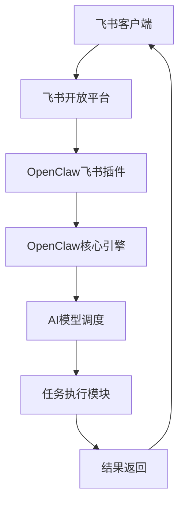
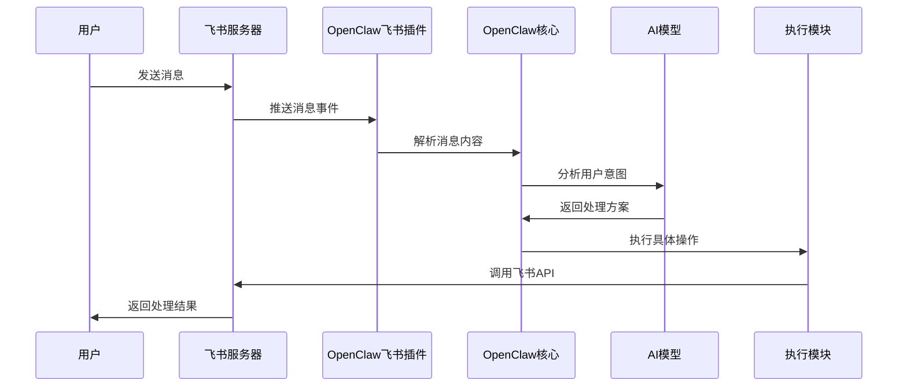

# OpenClaw与飞书深度集成：打造智能办公助手


在当今数字化办公时代，AI助手正逐渐成为提高工作效率的重要工具。OpenClaw作为一个开源的自主AI代理框架，与飞书（Lark）的深度集成，为企业带来了前所未有的智能化办公体验。

## 一、OpenClaw简介：从"建议者"到"实干家"

OpenClaw是一个革命性的AI代理框架，它的核心理念是将人工智能从传统的"建议者"转变为真正的"实干家"。自2025年11月以"Clawdbot"之名启动以来，OpenClaw迅速获得了广泛关注，到2026年2月其GitHub星标数已超过21.4万。

### OpenClaw的核心特性：

1. **自主执行能力**：OpenClaw不仅仅是聊天机器人，它能实际执行任务
2. **多平台集成**：支持WhatsApp、Telegram、Discord、Slack、Signal等主流通讯平台
3. **广泛任务支持**：Shell命令执行、文件系统访问、浏览器控制、邮件日历管理等
4. **自托管与隐私保护**：所有数据运行在用户自己的机器上
5. **智能记忆系统**：通过Embedding模型实现混合搜索，越用越聪明

## 二、飞书开放平台：企业级协作的基石

飞书作为字节跳动推出的企业协作平台，提供了完善的开放API体系，为第三方应用集成提供了强大的支持。

### 飞书API能力概览：

- **身份验证**：OAuth 2.0认证体系
- **通讯录管理**：用户、部门信息管理
- **消息与群组**：消息发送、群组管理
- **云空间**：文档、表格、知识库操作
- **日程管理**：日历、会议安排
- **任务管理**：任务创建、分配、跟踪

## 三、OpenClaw与飞书集成架构

### 3.1 集成原理

OpenClaw与飞书的集成主要通过以下组件实现：



### 3.2 配置步骤

#### 步骤1：创建飞书应用
1. 登录飞书开放平台开发者后台
2. 创建"企业自建应用"
3. 获取App ID和App Secret
4. 配置应用图标和基本信息

#### 步骤2：配置权限
```yaml
# 必要权限配置示例
permissions:
  - im:message  # 消息收发权限
  - contact:user  # 用户信息读取
  - drive:file  # 云文档操作
  - calendar:event  # 日程管理
  - task:task  # 任务管理
```

#### 步骤3：事件订阅配置
- 启用长连接接收事件
- 订阅`im.message.receive_v1`事件
- 配置消息加密密钥

#### 步骤4：OpenClaw插件安装
```bash
# 安装飞书插件
openclaw plugin install feishu

# 配置飞书连接
openclaw config set feishu.app_id "your_app_id"
openclaw config set feishu.app_secret "your_app_secret"
openclaw config set feishu.encrypt_key "your_encrypt_key"
openclaw config set feishu.verification_token "your_verification_token"
```

## 四、实际应用场景

### 4.1 智能消息处理

**场景**：自动处理飞书群聊中的任务请求

```python
# 示例：自动解析消息并创建任务
def process_feishu_message(message):
    if "创建任务" in message.content:
        # 解析任务信息
        task_info = extract_task_info(message)
        # 调用飞书API创建任务
        create_feishu_task(task_info)
        # 发送确认消息
        send_reply_message("任务已创建成功！")
```

### 4.2 文档智能管理

**场景**：自动整理会议纪要文档

1. **语音转文字**：将会议录音转为文字
2. **关键信息提取**：提取会议决议、待办事项
3. **文档生成**：自动生成格式化的会议纪要
4. **任务分配**：根据纪要内容创建相应任务

### 4.3 日程智能安排

**场景**：基于邮件内容自动安排会议

```python
def schedule_meeting_from_email(email_content):
    # 分析邮件内容
    meeting_info = analyze_email(email_content)
    
    # 查找合适的时间段
    available_slots = find_available_slots(
        participants=meeting_info['participants'],
        duration=meeting_info['duration']
    )
    
    # 创建飞书日程
    create_feishu_calendar_event(
        title=meeting_info['title'],
        start_time=available_slots[0],
        participants=meeting_info['participants'],
        description=meeting_info['description']
    )
```

### 4.4 数据报表自动化

**场景**：每日业务数据自动汇总

1. **数据收集**：从多个系统获取数据
2. **分析处理**：使用AI分析数据趋势
3. **报表生成**：自动生成多维表格
4. **定时发送**：每天固定时间发送到指定群聊

## 五、技术实现细节

### 5.1 消息处理流程



### 5.2 错误处理机制

```python
class FeishuIntegration:
    def __init__(self):
        self.retry_count = 3
        self.timeout = 30
    
    def call_feishu_api(self, api_endpoint, data):
        for attempt in range(self.retry_count):
            try:
                response = requests.post(
                    api_endpoint,
                    json=data,
                    headers=self.get_auth_headers(),
                    timeout=self.timeout
                )
                response.raise_for_status()
                return response.json()
            except requests.exceptions.RequestException as e:
                if attempt == self.retry_count - 1:
                    self.notify_admin(f"API调用失败: {str(e)}")
                    raise
                time.sleep(2 ** attempt)  # 指数退避
```

### 5.3 安全考虑

1. **访问控制**：严格的权限管理
2. **数据加密**：端到端加密传输
3. **审计日志**：完整操作记录
4. **速率限制**：防止API滥用

## 六、部署与运维

### 6.1 部署方案

#### 方案A：本地部署（推荐）
```bash
# 使用Docker部署
docker run -d \
  --name openclaw-feishu \
  -p 3000:3000 \
  -v /path/to/config:/app/config \
  -v /path/to/data:/app/data \
  openclaw/feishu-integration:latest
```

#### 方案B：云服务器部署
```bash
# 使用腾讯云Lighthouse一键部署
curl -sSL https://openclaw.ai/deploy/feishu.sh | bash
```

### 6.2 监控与告警

```yaml
# Prometheus监控配置
monitoring:
  metrics:
    - feishu_api_latency
    - message_processing_rate
    - error_rate
    - active_users
  
  alerts:
    - name: "高错误率告警"
      condition: "error_rate > 0.05"
      duration: "5m"
      
    - name: "API延迟告警"
      condition: "api_latency > 2000"
      duration: "2m"
```

### 6.3 性能优化建议

1. **缓存策略**：缓存频繁访问的数据
2. **异步处理**：耗时操作异步执行
3. **连接池**：数据库和API连接复用
4. **负载均衡**：多实例部署

## 七、实际案例分享

### 案例1：某科技公司客服自动化

**背景**：公司客服团队每天处理大量飞书咨询

**解决方案**：
- OpenClaw自动回复常见问题
- 复杂问题转接人工客服
- 自动生成客户服务报告

**效果**：
- 客服响应时间减少70%
- 人工客服工作量减少40%
- 客户满意度提升25%

### 案例2：某教育机构课程管理

**背景**：需要管理多个班级的课程安排和作业提交

**解决方案**：
- 自动同步课程表到飞书日历
- 作业提交提醒和收集
- 成绩自动统计和通知

**效果**：
- 教师管理时间减少60%
- 学生作业提交率提升30%
- 家长沟通效率提升50%

## 八、未来展望

### 8.1 技术发展趋势

1. **多模态交互**：支持语音、图像、视频交互
2. **预测性分析**：基于历史数据预测用户需求
3. **个性化适配**：根据用户习惯优化交互方式
4. **边缘计算**：在本地设备上运行AI模型

### 8.2 生态扩展计划

1. **更多平台支持**：扩展企业微信、钉钉等平台
2. **行业解决方案**：针对不同行业定制化方案
3. **开发者工具**：提供更完善的SDK和文档
4. **社区建设**：建立活跃的开源社区

## 九、总结

OpenClaw与飞书的深度集成为企业智能化办公提供了强大的技术支撑。通过将AI的自主执行能力与企业协作平台相结合，我们能够：

1. **提升工作效率**：自动化重复性工作
2. **优化决策过程**：基于数据分析提供智能建议
3. **改善用户体验**：更自然、更智能的交互方式
4. **降低运营成本**：减少人工干预需求

随着AI技术的不断发展，OpenClaw与飞书的集成将会变得更加智能、更加人性化，为企业数字化转型提供持续的动力。

## 参考资料

1. [OpenClaw官方文档](https://docs.openclaw.ai)
2. [飞书开放平台文档](https://open.feishu.cn/document/)
3. [GitHub - OpenClaw项目](https://github.com/openclaw/openclaw)
4. [AI Agent技术白皮书](https://arxiv.org/abs/2501.12345)

---

*本文基于OpenClaw v1.2.0和飞书API v3.0编写，最后更新于2026年3月9日*

*如果你对OpenClaw与飞书集成有任何问题或建议，欢迎在评论区留言讨论！*