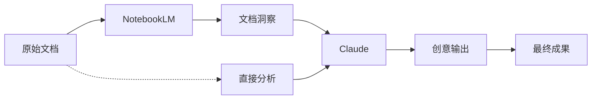
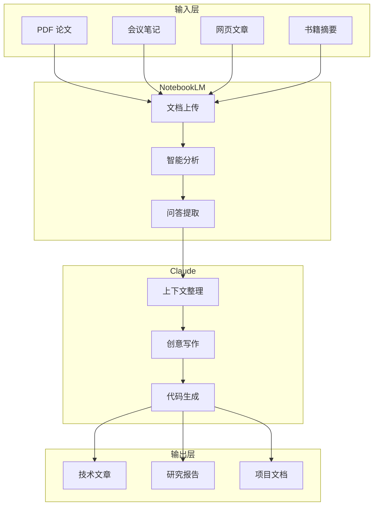
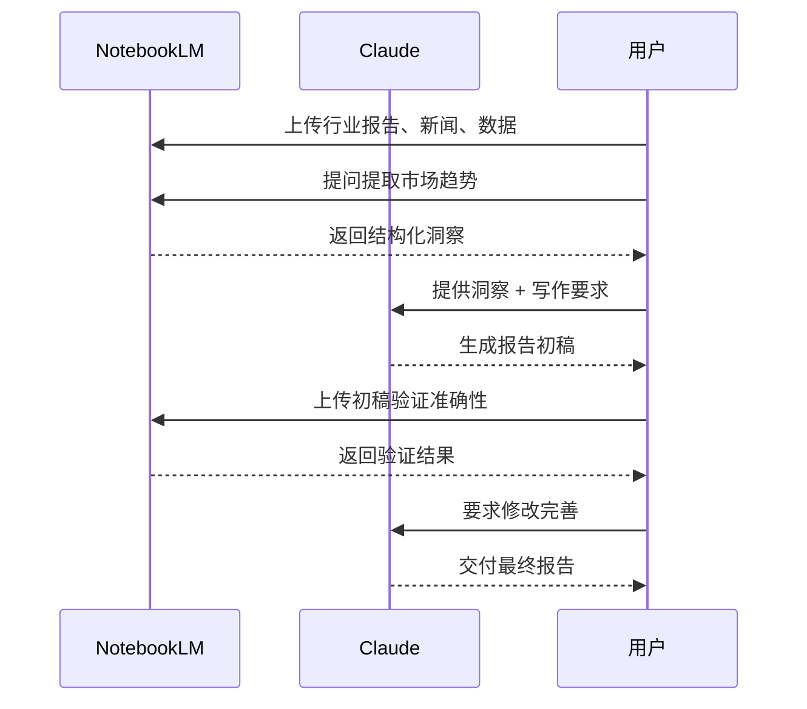

# Claude + NotebookLM 集成应用：打造个人知识管理双引擎


在 AI 工具蓬勃发展的今天，Claude 和 NotebookLM 分别代表了两种不同的 AI 辅助范式：Claude 擅长通用的对话、写作和代码生成，而 NotebookLM 则专注于基于文档的深度理解和分析。将两者结合起来使用，可以构建一个强大的个人知识管理双引擎系统。

## 一、工具简介

### 1.1 Claude：全能型 AI 助手

Claude 是 Anthropic 开发的大型语言模型，以其出色的推理能力、长上下文处理和安全的 AI 设计理念而闻名。

**Claude 的核心优势：**

- **长上下文支持**：可处理长达 200K tokens 的上下文
- **优秀的写作能力**：文章、邮件、报告等各类文本生成
- **代码能力**：支持多种编程语言的生成、调试和解释
- **推理分析**：复杂的逻辑推理和问题拆解
- **多轮对话**：流畅的对话体验和记忆能力

### 1.2 NotebookLM：文档智能分析专家

NotebookLM 是 Google 推出的"AI 优先笔记应用"，专注于基于用户上传的文档进行智能分析和问答。

**NotebookLM 的核心优势：**

- **文档理解**：深度分析 PDF、文档、笔记等多种格式
- **来源引用**：所有回答都标注具体来源位置
- **知识关联**：自动发现不同文档间的联系
- **音频摘要**：可将文档转换为音频概要
- **项目化管理**：按项目组织文档和笔记

## 二、为什么需要集成使用？

### 2.1 单一工具的局限性

| 工具 | 优势 | 局限 |
|------|------|------|
| Claude | 通用能力强，写作流畅 | 无法直接访问大量本地文档 |
| NotebookLM | 文档分析深入，引用准确 | 创意写作和代码能力较弱 |

### 2.2 集成带来的价值



**集成价值：**

1. **知识输入** → NotebookLM 处理大量文档
2. **深度理解** → NotebookLM 提取关键洞察
3. **创意加工** → Claude 进行创意写作和扩展
4. **成果输出** → 高质量的文章、报告、代码

## 三、集成工作流程

### 3.1 整体架构



### 3.2 具体操作步骤

#### 步骤 1：在 NotebookLM 中建立知识库

1. 创建新项目（如"机器学习学习笔记"）
2. 上传相关资料：
   - PDF 论文和教程
   - 个人笔记（Markdown、TXT）
   - 网页剪藏
   - 会议纪要

#### 步骤 2：使用 NotebookLM 进行文档分析

```
向 NotebookLM 提问：
- "这份文档的核心观点是什么？"
- "这些论文之间有什么联系？"
- "提取所有关于 X 技术的描述"
- "总结这个项目的主要进展"
```

#### 步骤 3：将洞察传递给 Claude

复制 NotebookLM 的分析结果，向 Claude 提供结构化的上下文：

```
请基于以下资料帮我写一篇技术文章：

【主题】机器学习中的注意力机制

【NotebookLM 提取的核心概念】
1. 注意力机制的核心思想...
2. Self-Attention 的计算过程...
3. Transformer 架构的创新点...

【关键引用】
- 论文 A 指出...
- 教程 B 说明...

【写作要求】
- 目标读者：有 Python 基础的开发者
- 文章长度：约 3000 字
- 包含代码示例
- 结构清晰，循序渐进
```

#### 步骤 4：Claude 生成初稿

Claude 会基于提供的上下文生成文章初稿。

#### 步骤 5：迭代优化

- 将初稿保存为文档
- 可再次上传到 NotebookLM 进行审查
- 询问 NotebookLM"文章是否准确反映了原始资料"
- 根据反馈让 Claude 进行修改

## 四、实际应用场景

### 4.1 场景一：技术文章写作

**背景**：你想写一篇关于"大语言模型原理"的技术文章

**工作流程：**

| 步骤 | 工具 | 操作 |
|------|------|------|
| 1 | NotebookLM | 上传 10 篇相关论文和教程 |
| 2 | NotebookLM | 提问提取核心概念和公式 |
| 3 | Claude | 基于提取的内容撰写文章大纲 |
| 4 | Claude | 逐章节写作，包含代码示例 |
| 5 | NotebookLM | 审查文章准确性 |
| 6 | Claude | 根据反馈修改完善 |

**Prompt 示例：**

```
我正在写一篇关于 Transformer 架构的技术文章。以下是我从
NotebookLM 中提取的核心知识点：

[粘贴 NotebookLM 的分析结果]

请帮我：
1. 设计文章结构，确保逻辑清晰
2. 为每个章节编写详细内容
3. 添加 PyTorch 代码示例
4. 用通俗的比喻解释复杂概念

目标读者是有 Python 基础但不熟悉深度学习的开发者。
```

### 4.2 场景二：研究报告撰写

**背景**：需要撰写一份行业研究报告

**工作流程：**



### 4.3 场景三：学习笔记整理

**背景**：学习一门新课程，需要整理笔记

**工作流程：**

1. **课程中**：用任何工具记录原始笔记
2. **上传 NotebookLM**：整理并上传所有笔记
3. **NotebookLM 分析**：
   - "这门课程的核心框架是什么？"
   - "各个章节之间有什么联系？"
   - "提取所有重要公式和定义"
4. **Claude 整理**：
   - 生成结构化的学习笔记
   - 创建复习提纲
   - 编写练习题和解答

### 4.4 场景四：代码项目文档

**背景**：为一个开源项目编写文档

**工作流程：**

| NotebookLM 处理 | Claude 处理 |
|----------------|-------------|
| 上传源码文件 | 生成 API 文档 |
| 上传 PR 描述和 Issue | 编写使用教程 |
| 提取功能说明 | 撰写 README |
| 分析代码结构 | 创建示例代码 |

**Claude Prompt 示例：**

```
我正在为一个 Python 数据分析库编写文档。以下是 NotebookLM
分析的代码结构和功能说明：

[粘贴分析结果]

请帮我：
1. 编写清晰的 README.md
2. 创建快速入门教程
3. 为每个主要函数编写使用示例
4. 添加常见问题解答 (FAQ)
```

## 五、高级技巧

### 5.1 上下文管理技巧

**技巧 1：分块传递**

当内容太多时，分块传递给 Claude：

```
【第 1 部分/共 3 部分】
这是关于注意力机制的第一部分资料...
（先不要求写作，让 Claude 理解内容）

【第 2 部分/共 3 部分】
继续发送...

【第 3 部分/共 3 部分】
最后一部分...

现在请基于以上所有资料，帮我...
```

**技巧 2：建立模板**

创建常用的 Prompt 模板：

```markdown
# 文章写作模板

【主题】{主题名称}

【目标读者】{读者画像}

【核心知识点】（来自 NotebookLM）
{知识点列表}

【写作要求】
- 字数：{要求}
- 风格：{技术/通俗/学术}
- 包含：{代码/图表/案例}

【参考结构】
1. 引言
2. 核心概念
3. 实践示例
4. 总结
```

### 5.2 质量保证

**双重验证流程：**

```
1. NotebookLM 提取 → 确保信息准确
2. Claude 创作 → 确保表达清晰
3. NotebookLM 审查 → 验证内容一致性
4. Claude 修订 → 最终完善
```

### 5.3 效率提升技巧

**技巧 1：并行处理**

- 在 NotebookLM 分析文档的同时，让 Claude 准备写作框架
- 多个项目并行时，为每个项目建立独立的 NotebookLM 项目

**技巧 2：复用成果**

- 将 Claude 生成的优质内容保存为模板
- 建立个人知识库，重复使用有价值的分析结果

## 六、工具对比与选择

### 6.1 功能对比表

| 功能 | Claude | NotebookLM | 集成方案 |
|------|--------|------------|----------|
| 文档上传 | ❌ | ✅ | NotebookLM |
| 来源引用 | ❌ | ✅ | NotebookLM |
| 创意写作 | ✅ | ❌ | Claude |
| 代码生成 | ✅ | ❌ | Claude |
| 长文本处理 | ✅ (200K) | ✅ (50 源) | 两者结合 |
| 多轮对话 | ✅ | ⚠️ 有限 | Claude |
| 知识关联 | ⚠️ | ✅ | NotebookLM |

### 6.2 使用建议

**只用 Claude 的场景：**
- 纯创意写作
- 代码相关任务
- 开放式问题讨论

**只用 NotebookLM 的场景：**
- 单文档问答
- 需要准确引用的查询
- 快速文档摘要

**集成使用的场景：**
- 基于大量资料写作
- 研究和报告撰写
- 系统性知识整理

## 七、未来展望

### 7.1 技术发展趋势

1. **更深度集成**：未来可能出现直接的工具间 API 调用
2. **自动化工作流**：一键触发完整的分析 - 写作流程
3. **多模态支持**：图片、音频、视频的统一处理

### 7.2 个人知识管理演进

```
传统方式 → AI 辅助 → 双引擎集成 → ？
  (手动)    (单工具)   (多工具协同)  (自动代理)
```

## 八、总结

Claude 和 NotebookLM 的集成使用代表了一种新的 AI 辅助工作范式：

| 阶段 | 工具 | 价值 |
|------|------|------|
| 输入 | NotebookLM | 高效处理大量文档 |
| 理解 | NotebookLM | 深度分析和提取 |
| 加工 | Claude | 创意写作和扩展 |
| 输出 | Claude | 高质量成果 |

**核心优势：**

1. **准确性**：NotebookLM 确保信息来源可靠
2. **创造性**：Claude 提供流畅的表达和创意
3. **效率**：自动化处理繁琐的信息整理工作
4. **质量**：双重验证保证最终成果质量

**开始行动：**

1. 注册并熟悉两个工具
2. 选择一个小型项目开始尝试
3. 逐步建立自己的工作流程
4. 持续优化和改进

AI 工具的价值不在于替代人类思考，而在于放大人类的能力。Claude + NotebookLM 的双引擎系统，可以帮助你更好地管理知识、提升效率、创造价值。

---

*最后更新：2026 年 3 月 15 日*

*如果你有任何问题或想分享你的使用经验，欢迎在评论区留言！*

## 参考资料

1. [Claude 官方文档](https://docs.anthropic.com)
2. [NotebookLM 官方指南](https://notebooklm.google.com)
3. [Anthropic 研究论文](https://anthropic.com/research)
4. [Google AI 博客](https://blog.google/technology/ai)
